# Journal Racoon

## FEV/MAR 2019

- Mecanique de "gossip" permettant de dater les transactions à l'interieur de la VDF, et d'empecher
  le validateur de revenir en arrière. Une 2ème VDF permet au validateur du bloc suivant d'attester
  de cette VDF en temps réel, obligeant le premier à publier sa VDF en temps réel.
  
**Problèmatiques :**
On veut avoir des transactions à la seconde, ce n’est pas possible dans les systèmes existants :
BTC : 10min/tx 
ETH : 14sec/tx latence réseau mondiale.

**Solution**
On met en place une mécanique de gossip qui permet d’horodater toutes les transactions.
Le calcul de l’interval entre deux blocs est basé sur une VDF.
On profite de ce calcul pour ajouter dans les tranaction l’état de la VDF pour la dater. On rajoute aussi une preuve de l’état après l’application de la transaction.
Le calcul de la VDF entre du bloc n → n+1 commence est publiée à interval régulier et est attestée dans la VDF du bloc n+1 → n+2
  

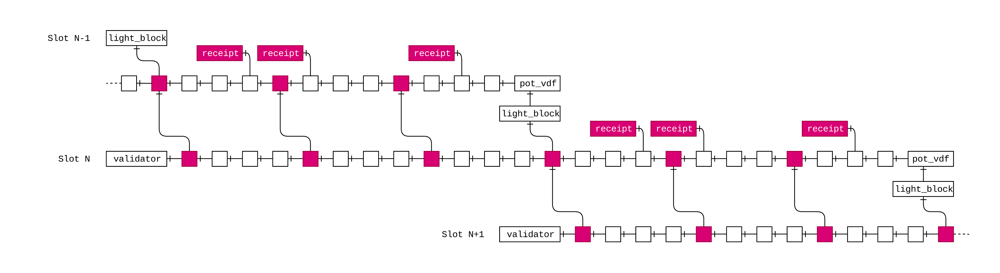

  
- Mecanique des mondes permettant de supprimer des shards sans perte de données.

**Problèmatiques :**
On veut mettre en place un système de sharding afin de permettre une meilleurs scalabilité de la chaîne. Une shard ne contient qu’une partie des donnée de la blockchain et est donc plus rapide à valider car le travail est réparti entre les shards.
Rajouter une shard n’est pas compliqué, par contre c’est très difficile à supprimer car elle peut être la seule à contenir certaine données. Cependant on veut pouvoir supprimer une shard si ses mineurs décident de l’abandonner. Si on duplique des données d’une shard à sa mort, on risque des conflits avec d’autres contrats d’autres shards.

**Solutions** :
On met en place un système de Monde. Les données sont stockées dans des Mondes. Les shards stockent toutes leurs données dans un ou plusieurs Monde ainsi il n’y a pas de perte ni de conflit lors de la suppression. Un monde n’appartient qu’à une seule shard pour éviter les pb d’écriture concurrente.

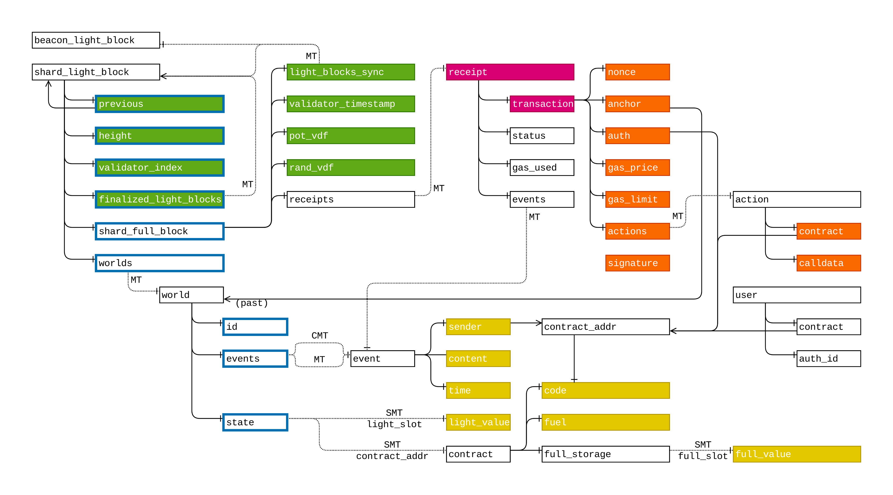

## Avril 2019 :

- Formule de poids fair

**Problèmatiques :**
On ne veut pas de POW qui est problématique écologiquement et au niveau délai entre blocs. On veut une POS qui évite que beaucoup de mineurs valident le même bloc en parallèle.
Sur une période de temps à venir on a besoin de déterminer qui sera le validateur le plus probable afin de décourager les autres et de pouvoir suivre le consensus d’une shard sur les autres.
On veut éviter les validateurs malveillants (SYBIL).
On veut éviter le split de la stake pour un même validateur.
On veut éviter de proposer un avantage au regroupement de validateur.

**Solutions** :
On met en place une stake tradable. 
Selon la stake possédée, un validateur doit avoir plus de chance proportionelment d’être le validateur d’un bloc.

https://www.dropbox.com/s/8jhdzw2vi0wqdvz/tom_blockchain.pdf?dl=0

**Problèmatique**
Il n’existe pas de mécanique pour générer des nombres aléatoires non manipulable sur une blockchain. On en a besoin pour le consensus déterministe et non prédictibe.

**Solution**
On met en place une VDF de longue durée qui permet de fixer une valeur de seed unique qui ne sera pas manipulable car elle utilise une donnée d’entrée qui sera entérinée sur la chaine avant que la valeur générée ne soit connue.

**Problèmatiques :**
Eviter qu’un validateur puisse anticiper les prochains validateurs favorisés d’un bloc et transferré sa stake selon la meilleure addresse.

**Solution :**
on lui demande d’engager sa stake à l’avance : on met en place un système d’Ere. un validateur doit engager sa stake avant le début d’une Ere pour pouvoir participer à la validation.

**Problèmatique :**
Un utilisateur doit payer des frais pour pouvoir emettre une transaction.

**Solutions :**
On permet la création de shard permissionées. Gérée par le créateur d’une DAPP. Qui permet d’avoir des transaction gratuites potentiellement.
Le création doit payer le cout de fonctionnement de la shard au lieu des utilisateurs.
Il doit payer notament la récompense des validateurs de block.

**Abandon :**
Trop difficile de définir un bon modèle fuel/gas
Problème d’incentive car la récompense est fixe.
Problème de scalabilité car une seule shard.

**Solutions 2 :**

> Simplification du modèle de stockage avec système d'oubli (juillet)

- Emergency exit
**Problèmatiques :**
Les shards peuvent s’échanger des tokens et les contart les vérouiller. Cependant une shard peut cesser de fonctionnement (cf shard privée) ou ne plus réussir à communiquer avec les autres shards (action malveillante). Les tokens peuvent se retrouver bloqués.

**Solutions :**
Valider les mouvements d’un token sur une shard annexe sur la shard emetrice.
Système de sortie d’urgence :
Si une shard ne communique plus au bout d’un certain temps ou si elle s’auto déclare finie alors le dernier proprietaire connu peut réclamer son token sur la chaine emetrice. 

**Abandon :**
On se heurte au problème des généraux byzantin. Les deux shards ne peuvent pas se mettre d’accord si chacune d’elle est morte ou non.

**Solutions :**
Inherent au système : la communication cross shard ne peut pas se couper.

## Mai 2019

- authentication
**Problèmatiques**
Si on défini un système d’authentication au niveau de la blockchain on ne pourra pas le faire évoluer facilement pour raison de sécu ou pour interagir plus facilement avec une blockchain externe qui utiliserai une mécanique différente.

**Solutions :**
L’authentication est gérée par un contrat déployé sur la blockchain. On peut avoir différents contrats d’authentication pour gérer différente mécaniques (multisig, hash variés)

- namespaces
**Problèmatiques**
Les contrats doivent pouvoir être déployés sur plusieurs shards pour scaler.

**Solutions :**
Système de namespace pour pouvoir partager l’autorisation d’administration des tokens.

## Juin 2019 :

- Structure de contrats
**Problèmatiques & solutions :**
Avec Ethereum un contrat stocke toutes ses données à vie. Cela prend de la place.
→ Le contrat a une mécanique de fiul. Les données sont supprimées si un contrat n’en a plus.

Les données stockées sur toutes toutes les shards coûtent très cher.
→ Séparer les données dont on a besoin d’avoir la connaissance sur toute la chaîne des données ponctuelles pour lesquelle on peut simplement forcer l’envoi au moment de la transaction avec une preuve de validitée.

On a besoin de communiquer entre contrats.
→ Mise en place d’un système d’event. Chaque contrat peut emettre des event lors d’une transaction.

- Design du contrat unique de gestion des tokens
**Problèmatiques :**
Sur Ethereum il y a différent standards de token et il n’y a pas de pris en compte de la vision globale, pas de retrocompatibilité et chaque token est libre d’inventer ses propre méthode. Les conventions ne sont pas respectées.

**Solutions :**
Un contrat unique permet de gérer l’ensemble des tokens de tous les contrats.
L’emission d’un nouveau token passe par le contrat de gestion des token standard.
Chaque token est possédé par un utilisateur. Il peut être transferré. Il peut être utilisé dans un contrat dans lequel il sera vérouillé. Il peut il libéré par ce contrat. Un contrat peut changer son proprietaire si il est vérouillé chez lui. Le contrat emetteur peut détruire des tokens si il est vérouillé chez lui.

**Problèmatiques :**
Lors d’un transfert de token cross shard
On ne peut pas s’assure qu’un token n’est pas utilisable sur la shard emetrice.
On ne connait pas les données propres au token sur la shard destinataire.

**Solutions :**
Un token peut avoir des propriétés. Le contrat unique est capable d’exporter et d’importer via le système d’events.

**Problèmatiques :**
Lors d’un transfert de token, plusieurs shards peuvent revendiquer le même event.
**Solutions :**
On veut que certains events ne puisse pas être exploité qu’une seule fois sur l’ensemble de la chaîne : on met place un système d’event consomable. Si une shard utiliser un event alors plus aucune shard ne pourra le faire à nouveau.

## JUL/AUG 2019 :

- Simplification du modèle de stockage avec système d'oubli & Contrat v2
**Abandon contrat v1 :**
Quand un contrat n’a plus de fioul, les données sont supprimées / tous ses états sont perdus.
Quand on doit supprimer une shard et migrer un monde il faut copier toutes les données.
Le cout du déplacement d’un monde est trop élévé car il y a trop de données.
Quand un contrat est supprimés, tous ses tokens sont supprimés et si ils sont sur d’autre charge cela pose prolbème.
Complexité du système de namespace.

**Problèmatiques :**
Les contrats meurent.
Les contrats sur plusieurs shards sont trop complexes

**Solutions :**
→ Un contrat a une adresse unique qui dépend uniquement de son code. Il peut être déployé à la même addresse sur plusieurs shards différentes par n’importe qui. Si je veux utiliser un token sur un contrat d’une autre shard je peux instancier ce contrat sur la shard.
→ Toutes les données sont fournies par les utilisateur dans les transaction et doivent fournir la preuvent de validité. La donnée  (code, état, data) est stockée dans un cache au niveau de la shard.
Si on déplace un monde d’uns shard à une autre cela implique de migrer simplement le state du monde (les root des évennement, root du monde).

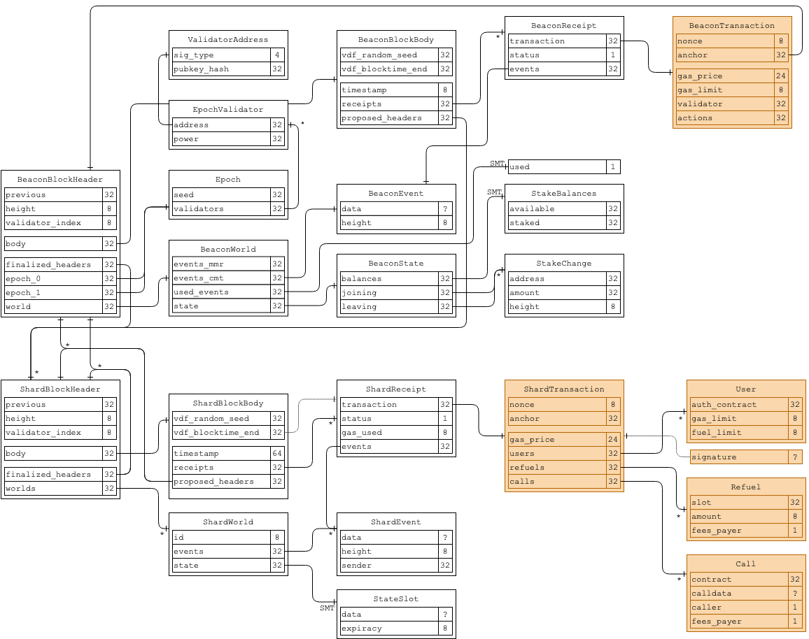

→ On supprimer le mécanique de lock d’un token dans un contrat. On remplace par un transfert d’ownership vers un contrat. En effet un contrat ne peut plus mourir.

## Septembre 2019 (à voir selon temps passé pour passer sur 2020)

- Preuve de fairness de la formule de poids de la POS
**Problèmatique :**
La formule trouvé se basait sur des nombres réels. En informatique, la précison entre deux machines de deux validateurs peut provoquer un dysfonctionnement.

**Solutions :**
Passer la formule en entiers → toujours pas trouvée

Avoir une précision fixe :

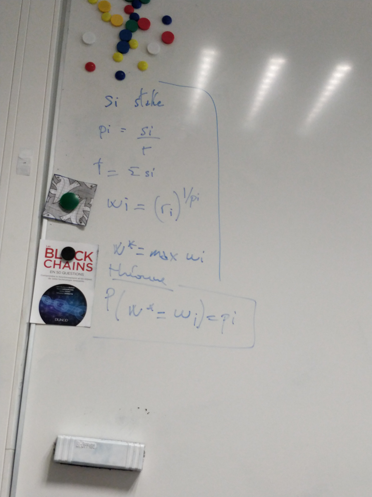
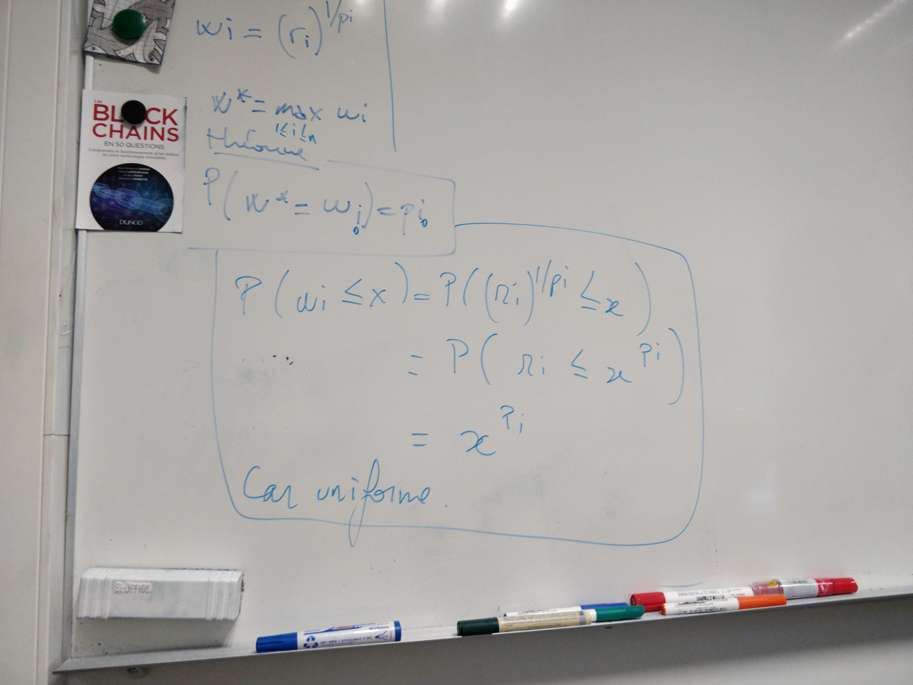
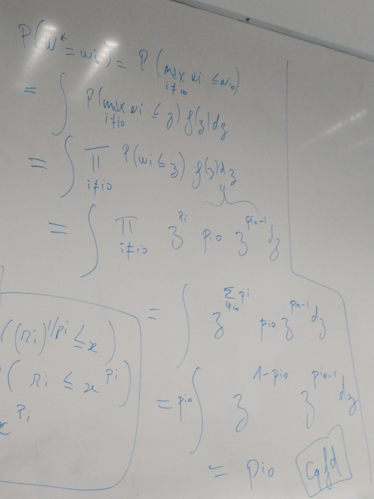

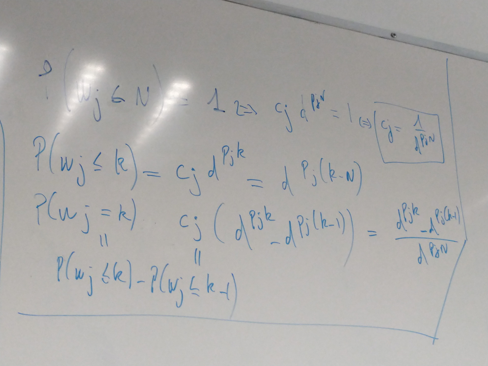
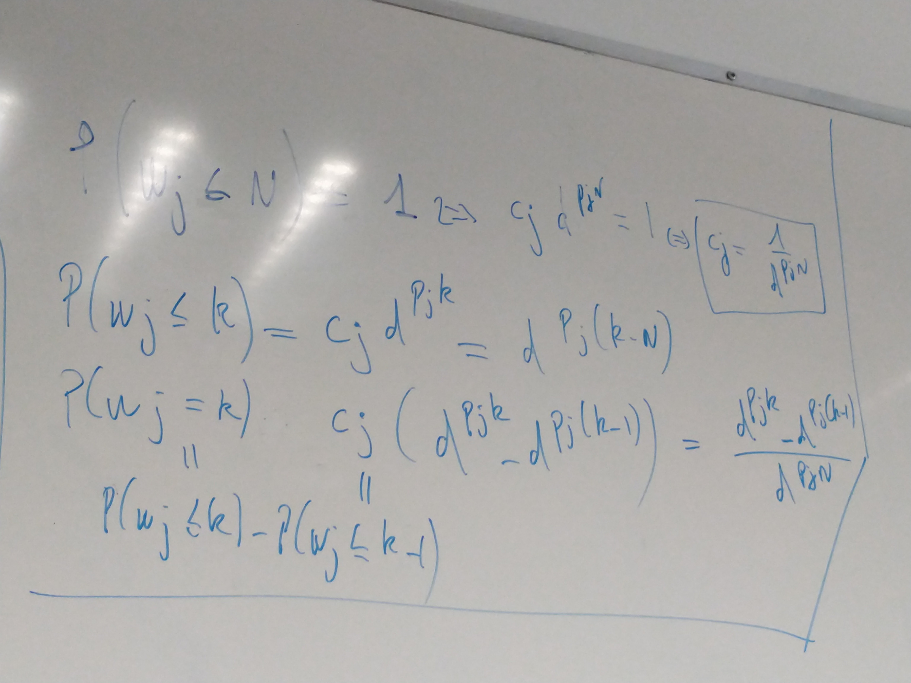
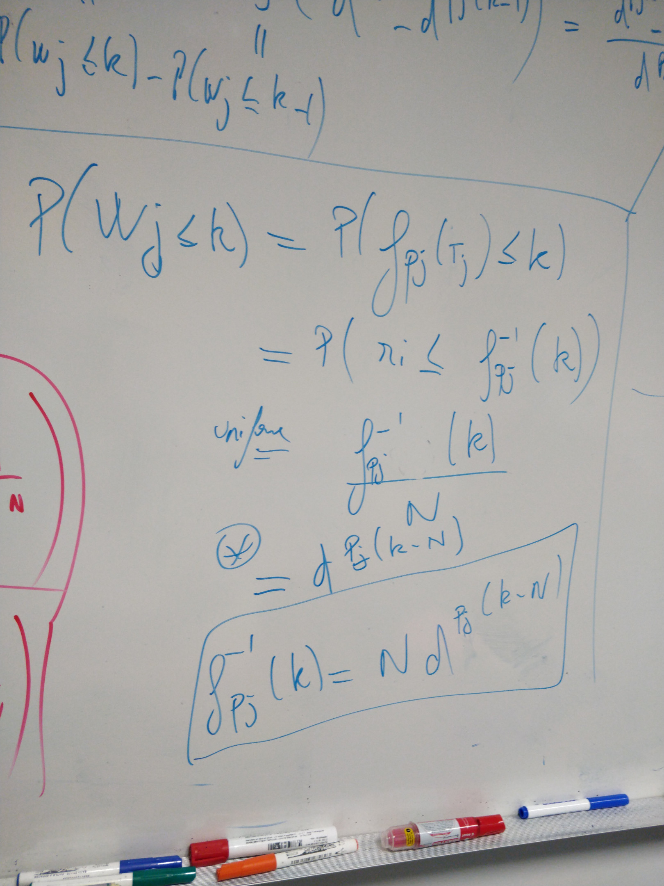

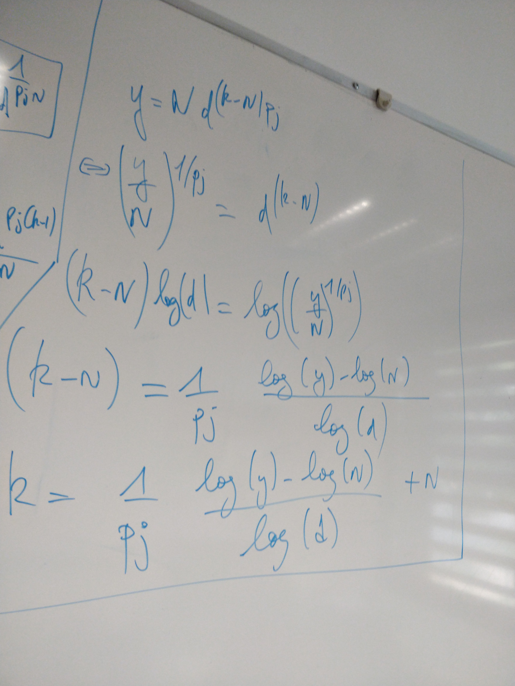
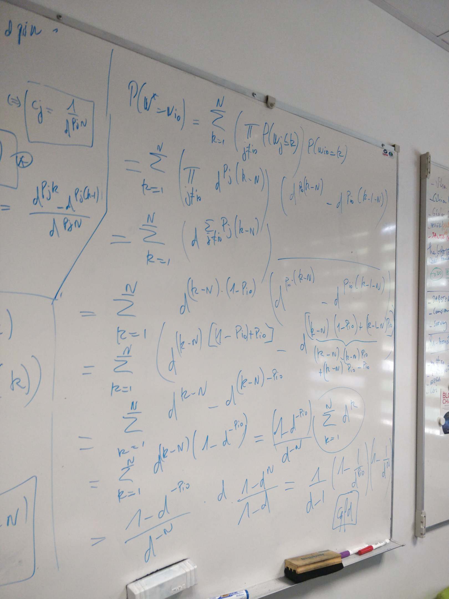

Empirique :

    Results (10 top validators) :
    power         win rate       wins    diff
    0.45049871    0.44992600   224963    -0.00057271
    0.22986962    0.22967800   114839    -0.00019162
    0.20407044    0.20441200   102206    +0.00034156
    0.07271491    0.07282600    36413    +0.00011109
    0.03416860    0.03424800    17124    +0.00007940
    0.00520185    0.00544600     2723    +0.00024415
    0.00168669    0.00156800      784    -0.00011869
    0.00080449    0.00087400      437    +0.00006951
    0.00056451    0.00061600      308    +0.00005149
    0.00042018    0.00040600      203    -0.00001418
    min winner score : 5.3495285e-7
    max winner score : 9.9999043e-1
    avr winner score : 4.9941503e-1
    max multi shard win : 264

- Formule de calcul des frais d'une transaction

**Problèmatiques :**
Il faut rémunérer les validateur pour les inciter à miner les transactions.
Il faut pouvoir automatiser certaines action sur la blockchain (suppression de shard, migration de monde) et rémunérer les validateurs de ces opération.

**Solutions :**
Les transactions ont un coût.
La DAO doit pouvoir financer cela en se constitunt au fil du temps un fond propre.

    fees = gas * (gasprice + BASE_GASPRICE) + fuel * FUELPRICE
    reward = 0.6 * fees
    dao = 0.4 * fees

- Inspiration du "Reverse Nakamoto", choix du block précédent après la VDF (réalisée sur le block N-2).

**Problèmatiques :**
La latence réseau peut altérer le temps entre block.
Le consensus peut être erroné/instable car le validateur peut recevoir un meilleur block précédent alors qu’il a déjà commencé son gossip sur un autre bloc plus rapide mais moins légitime.

**Solutions :**
La VDF d’intervalle entre deux block commence au block n-2 (qui est connue plus à l’avance).
On change la façon dont sont liées les blocks. Le bloc précedent est chosis à la fin de la VDF.

**Problèmatique :**
Le système de gosip ne peut être maintenu.

**Solution :**
Le consensus est plus stable donc le temps de finalisation cross chain est plus rapide. On sera beaucoup plus rapidement certain qu’un bloc ne sera pas revert. On pourra réduire le temps entre 2 blocs.

## Octobre 2019 :

- Utilisation des Merkle Mountain Range pour les arbres append-only
**Problèmatiques :**
Les events sont stockés dans un arbre de Merkle en rateau. La taille de la preuve augmente avec l’ancienneté des évennements. (events plus récents plus courts)

**Solutions :**
On stocke une consolidation dans un nouvel arbre Merkle classqiue.

**Problèmatiques :**
La taille des preuves devient ingérable passée une certaine profondeur d’arbre (trop de hash)

**Solutions :**
On utilise un arbre MMR
Les events sont stockés dans un arbre . La taille de la preuve augmente de manière logarytmique avec le nb d’event. (event plus anciens plus courts)

## Janvier 2020 :

- Travaux sur un meilleur algorithme de consensus (Sum threshold)
**Problèmatique :**
Le poids de la chaine est egale à la somme du poids de tous ses blocks. On peut avoir une attaque long terme où une vieille chaine peut rattraper et dépasser une chaine légitime suite à une publication massive.

**Solution :**
On ne calcule par sur l’ensemble de la chaîne mais sur un fenêtre glissante. Le réseau est capable de diverger légitimement du calcul final depuis le block genesis optimal.
Pour rejoindre de réseau on peut néanmoin synchroniser depuis le genesis en applicant sur l’ensemble des forks obtenu la fenêtre glissante.
Mais on peut aussi partir simplement du bloc le plus récent faisant consensus sur le réseau.

La limite de la fenêtre peut être très basse.

empirique

    Config (
        validators_count: 20,
        stake_spread_factor: 5,
        vdf_block_ticks: 1_000_000,
        vdf_max_weight_ticks: 500_000,
        latency_ticks: 1_000_000,
        vdf_apply_retry_ticks: 200_000,
        finalization_weight: 3,
        stop_height: 20_000,
        step_stop: None,
    )

    Fairness : 0.006337611
    Average block time : 1489796.2
    Min block time : 0
    Max block time : 3499993
    Average even-odd block time : 1494741.2
    Min even-odd block time : 0
    Max even-odd block time : 3499993
    Average odd-even block time : 1484851.1
    Min odd-even block time : 0
    Max odd-even block time : 3499801

- Passage d'un sharding en arbre à un sharding en graphe pour baisser la latence cross-shard
**Problèmatique**
Plus le nombre le shard grandit, plus le temps de communication entre shard augmente (car il y a plus de shards intermédiaires).
**Solutions** 
On ne stocke plus dans un arbre mais un dans graph pour réduire la distance moyenne entre les shards.
La communication entre shard est plus compréhensible et visuellement intuitif.

